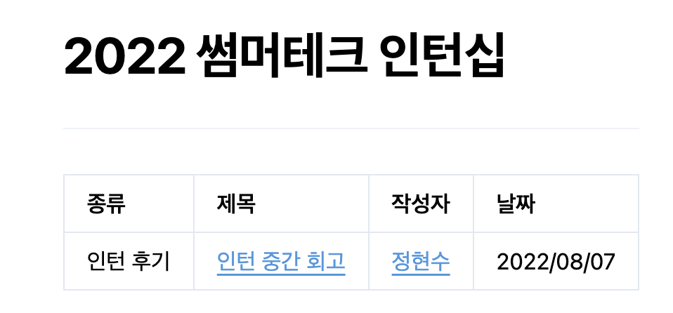

# 목차

- [개발환경 세팅하기](#개발환경-세팅하기)
- [리뷰 추가하기](#리뷰-추가하기)
  - [기존에 존재하는 리뷰활동 추가](#기존에-존재하는-리뷰활동-추가)
  - [기존에 존재하는 않는 리뷰활동 추가](#기존에-존재하지-않는-리뷰활동-추가)
  - [존재하지 않는 기업 추가](#존재하지-않는-기업-추가)
- [author 등록하기](#author-등록하기)

# 개발환경 세팅하기

```bash
# 1. 우선 프로젝트를 clone합니다.
$ git clone junghyeonsu/awesome-dev-activity-review

# 2. web 폴더로 이동합니다.
$ cd web

# 3. 의존성을 설치합니다.
$ yarn install

# 4. 개발 서버를 실행합니다.
$ yarn dev

# 5. localhost:3000 으로 접속합니다.
```

# 리뷰 추가하기

## 기존에 존재하는 리뷰활동 추가

`web` 파일의 구조를 살펴보면

```
📦web
  📦pages <- 페이지가 추가되는 곳
   ┣ 📂daangn
   ┃ ┣ 📜2021-daangn-internship.ko.mdx <- 각각의 카테고리 (리뷰들은 요기 있어요)
   ┃ ┣ 📜2021-daangn-mvp-internship.ko.mdx
   ┃ ┣ 📜2022-summer-tech-internship.ko.mdx
   ┃ ┣ 📜index.ko.mdx <- 회사 소개
   ┃ ┗ 📜meta.ko.json <- 카테고리별로 정보를 기입해주는 곳
   ┃ ...
   ┣ 📜_app.js
   ┣ 📜_document.js
   ┣ 📜index.ko.mdx
   ┗ 📜meta.ko.json
```

하나의 예시로 만약 `당근마켓`의 `2022년 여름방학 테크 인턴십`에 추가하고 싶다면,
`pages -> daangn -> 2022-summer-tech-intership.ko.mdx` 파일만 수정하면 됩니다.

```md
| 종류 | 제목 | 작성자 | 날짜 |
| --- | --- | --- | --- |
| 인턴 후기 | [인턴 중간 회고](https://junghyeonsu-dev.vercel.app/posts/Daangn-intern-middle-retrospect) | <Author author={authors.정현수} /> | 2022/08/07 |
<!-- 한 줄을 추가해주세요 -->
```

**중요한 점**

1. 작성자에는 `Author` 컴포넌트에 `author` props를 넘겨주어야 합니다.
2. 현재는 마크다운의 테이블 문법을 사용하고 있습니다. 한 줄을 추가해서 `Pull Request`를 날리면 됩니다.

## 기존에 존재하지 않는 리뷰활동 추가

기업은 존재하는데, 리뷰활동이 존재하지 않는다면 `mdx` 파일도 추가하고, 해당 기업의 `meta.ko.json` 파일을 수정해야 합니다.

만약 `당근마켓`의 `2022년 겨울방학 테크 인턴십`이라면 `2022-winter-tech-intership.ko.mdx` 파일을 만들어주세요. (파일의 이름은 기여자의 센스를 믿겠습니다, **`ko` 확장자를 무조건 붙여줘야 합니다.**)

그리고 아래와 같이 참고를해서 작성을 해주세요.
(종류는 마음대로, 날짜는 해당 블로그 포스팅 날짜를 적어주시면 됩니다.)

```mdx
import Author from '../../components/Author.tsx';
import authors from '../../authors.json';

# 2022 윈터테크 인턴십

---

| 종류 | 제목 | 작성자 | 날짜 |
| --- | --- | --- | --- |
| 인턴 후기 | [인턴 중간 회고](https://junghyeonsu-dev.vercel.app/posts/Daangn-intern-middle-retrospect) | <Author author={authors.정현수} /> | 2022/08/07 |
```

**중요한 점**

1. 작성자에는 `Author` 컴포넌트에 `author` props를 넘겨주어야 합니다.
2. 현재는 마크다운의 테이블 문법을 사용하고 있습니다.
3. **[만약 `authors`에 추가가 안되어있다면?](#author-등록하기)**

그 다음은 `meta.ko.json` 파일을 수정해줘야 웹에 카테고리로 뜨게됩니다.

```json
{
  "index": "회사 소개",
  "2022-summer-tech-internship": "2022 윈터테크 인턴십"
}
```

**중요한 점**

1. 앞에 `key`값은 새롭게 생성한 리뷰활동 파일명에서 `ko.mdx`를 뺀 값을 넣어줘야 합니다. 
2. `value` 값은 웹에서 띄우고자 하는 텍스트를 적어줍니다.

## 존재하지 않는 기업 추가

[이슈를 남겨주세요.](https://github.com/junghyeonsu/awesome-dev-activity-review/issues/new) 최대한 빨리 추가해드립니다`^_^`

# author 등록하기

`awesome-dev-activity-review`는 기여를 해준 사람을 `authors.json` 파일에서 관리하고 있습니다. 만약 기여가 처음이라면 해당 파일에 자신의 이름을 추가하고 `pull request`를 날려주세요.

```json
{
  "정현수": { // mdx파일에서 찾을 key값입니다. 띄어쓰기가 허용되지 않습니다.
    "name": "정현수", // 보여지는 이름입니다.
    "blog": "https://junghyeonsu-dev.vercel.app/" // 블로그 주소
  },
}
```

만약 이미 추가가 되어있는데 블로그 링크를 기재하지 않았으면 블로그 주소를 남기게 되면 아래와 같이 이름에 블로그 링크가 걸립니다.



